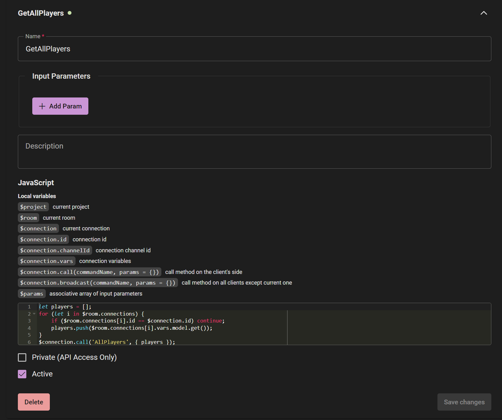

# Massive Realm Configuration

* Create an account
* Create a project


## Massive Realm Code

Client section defines event signatures callable by the client


Server section defines server processing 


```javascript
if (!$connection.vars.model) {
    $connection.vars.model = $room.model('Player');
    $connection.vars.model.id = $connection.id;
}

$connection.vars.model.x = $params.x;
$connection.vars.model.y = $params.y;

$connection.broadcast('MovePlayer', {
    player: $connection.vars.model.get()
});
```



```javascript
let players = [];
for (let i in $room.connections) {
    if ($room.connections[i].id == $connection.id) continue;
    players.push($room.connections[i].vars.model.get());
}
$connection.call('AllPlayers', { players });
```


Hooks


Models


Rooms

